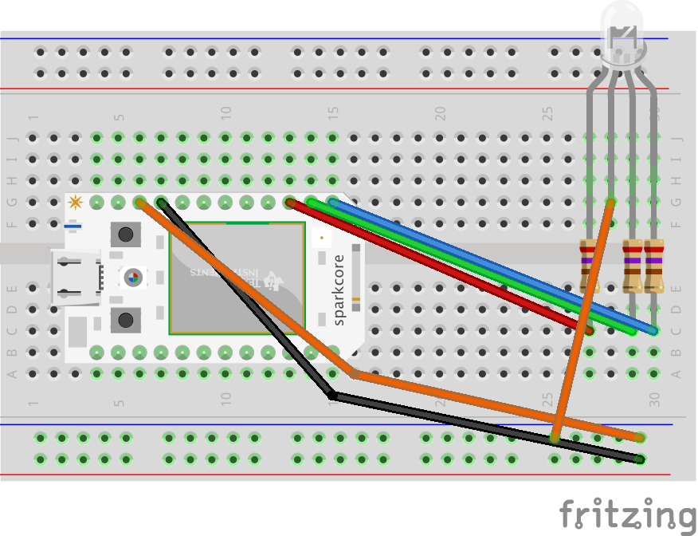

# Status

Continuous Integration status light I built for funzies. At the moment it only works with [CircleCI](http://www.circleci.com). Red light for epic fail, green for all-clear.

## Requirements
 * 1 x [SparkCore](http://www.spark.io)
 * 1 x Common-Cathode RGB LED
 * 3 x 270Ω resistors
 * Buncha wires
 * Probably a breadboard

*I used one of [these](http://oomlout.co.uk/products/led-pirhana-rgb-x3) but [these](http://www.amazon.co.uk/Round-Common-Cathode-Emitting-Diodes/dp/B005VMDROS) will probably do.

## Usage

1. Get your SparkCore online and install the [CLI tools](http://docs.spark.io/cli/)
2. Connect the RGB LED to your Spark Core via 270Ω resistors (see below)
3. Set the `DEVICE_ID` and `ACCESS_TOKEN` env vars (get these from Spark)
4. Deploy the proxy web service somewhere

        $ bundle install
        $ ruby proxy.rb

5. Provide the URL for this proxy web service in your project's `circle.yml`

        notify:
          webhooks:
            - url: https://<proxy service location>/builds

6. Compile the SparkCore firmware and flash it to your core

        $ spark flash <name of core> status.cpp

7. Wait for your CircleCI builds to pass or fail

## Schematic

